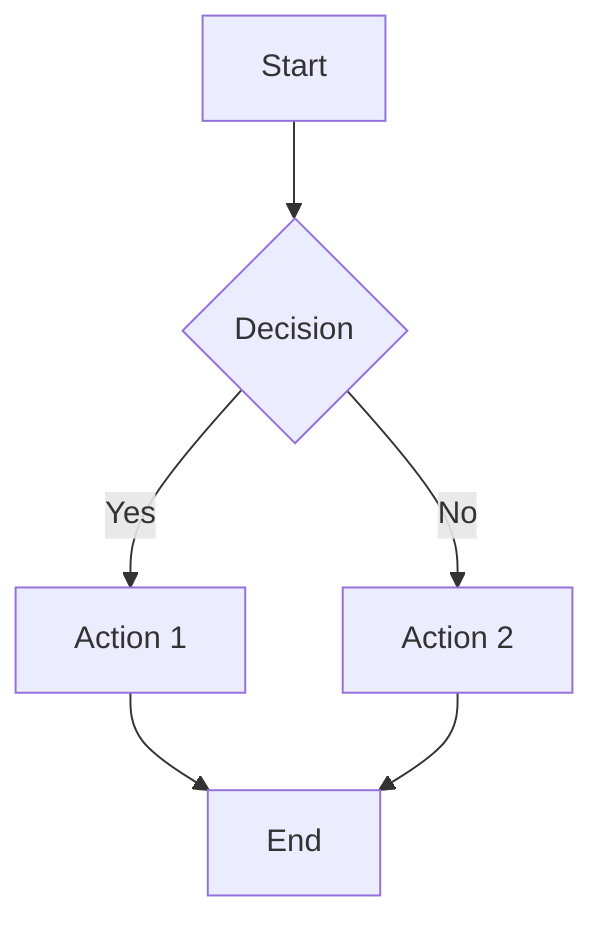
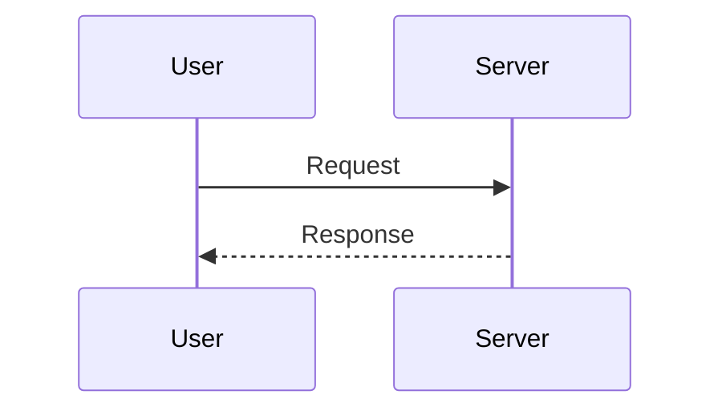

# Formatting Stress Test

This file tests edge cases and limits of the QuickLook markdown renderer.

## Heading Hierarchy Tests

### Multiple H1s in One Document

Below are additional H1 headings to test how the TOC handles multiple top-level headings.

# Second H1 Heading

Content under the second H1.

## Subsection of Second H1

Some content here.

### Deeper Nesting Under Second H1

More content.

# Third H1 Heading

Testing three H1s in one document.

## Another H2

Content.

# Fourth H1 - Empty Section

# Fifth H1 - Consecutive H1s

These two H1s have no content between them.

---

## Duplicate Heading Names

Testing how the TOC handles duplicate heading text.

### Completed

First "Completed" section.

### Completed

Second "Completed" section with same name.

### Completed

Third "Completed" section.

## Another Section

### Completed

Fourth "Completed" but under different parent.

### Results

First results section.

### Results

Second results section.

---

## Very Long Headings

### This Is An Extremely Long Heading That Goes On And On And Might Cause Wrapping Issues In The Table Of Contents Sidebar

Content under the very long heading.

## Short

Contrast with a very short heading.

### A

Single character heading.

### 123

Numeric heading.

### Special Characters: @#$%^&*()

Testing special characters in headings.

### Heading with `inline code` in it

Code in heading.

### Heading with **bold** and *italic*

Formatted text in heading.

### Heading with :rocket: emoji

Emoji shortcode in heading.

---

## Deep Nesting Test

### Level 3

#### Level 4

##### Level 5

###### Level 6

Content at the deepest level. Note: TOC only shows h1-h3.

### Back to Level 3

After deep nesting.

---

## Content Type Tests

### Code Blocks

```javascript
// JavaScript
function fibonacci(n) {
    if (n <= 1) return n;
    return fibonacci(n - 1) + fibonacci(n - 2);
}

console.log(fibonacci(10));
```

```python
# Python
def quicksort(arr):
    if len(arr) <= 1:
        return arr
    pivot = arr[len(arr) // 2]
    left = [x for x in arr if x < pivot]
    middle = [x for x in arr if x == pivot]
    right = [x for x in arr if x > pivot]
    return quicksort(left) + middle + quicksort(right)
```

```swift
// Swift
struct ContentView: View {
    @State private var count = 0

    var body: some View {
        VStack {
            Text("Count: \(count)")
            Button("Increment") {
                count += 1
            }
        }
    }
}
```

### Tables

| Feature | Status | Priority |
|---------|--------|----------|
| TOC Generation | Complete | High |
| Syntax Highlighting | Complete | High |
| Emoji Support | Complete | Medium |
| Mermaid Diagrams | Complete | Medium |

Wide table:

| Column 1 | Column 2 | Column 3 | Column 4 | Column 5 | Column 6 | Column 7 | Column 8 |
|----------|----------|----------|----------|----------|----------|----------|----------|
| Data | Data | Data | Data | Data | Data | Data | Data |
| More | More | More | More | More | More | More | More |

### Lists

Unordered:
- Item 1
  - Nested item 1.1
  - Nested item 1.2
    - Deep nested 1.2.1
- Item 2
- Item 3

Ordered:
1. First item
2. Second item
   1. Nested numbered
   2. Another nested
3. Third item

Mixed:
1. Ordered item
   - Unordered nested
   - Another unordered
2. Second ordered
   - Mix of
     1. Numbered inside
     2. Unordered

Task list:
- [x] Completed task
- [ ] Incomplete task
- [x] Another done
- [ ] Still pending

### Blockquotes

> Single line quote.

> Multi-line quote that spans
> across multiple lines and tests
> how blockquotes are rendered.

> Nested blockquote level 1
>> Nested level 2
>>> Nested level 3

### Links and Images

[External link](https://example.com)

[Link with title](https://example.com "Example Title")


### Inline Formatting

**Bold text** and *italic text* and ***bold italic text***.

`inline code` in a sentence.

~~Strikethrough text~~

Text with <mark>highlighted</mark> content.

Superscript: x<sup>2</sup> and subscript: H<sub>2</sub>O

### Emoji Shortcodes

Developer emoji: :bug: :rocket: :fire: :construction: :white_check_mark:

Reactions: :+1: :-1: :heart: :tada: :clap:

Faces: :smile: :laughing: :wink: :thinking: :sunglasses:

### Mermaid Diagrams





### Horizontal Rules

Above the rule.

---

Below the rule.

***

Another style.

___

Third style.

---

## Edge Cases

### Empty Sections

### Section With Only Whitespace


### HTML in Markdown

<div style="color: blue;">
This is HTML inside markdown.
</div>

<details>
<summary>Collapsible Section</summary>

Hidden content revealed on click.

</details>

### Escape Characters

\*Not italic\*

\`Not code\`

\# Not a heading

### Very Long Paragraph

Lorem ipsum dolor sit amet, consectetur adipiscing elit. Sed do eiusmod tempor incididunt ut labore et dolore magna aliqua. Ut enim ad minim veniam, quis nostrud exercitation ullamco laboris nisi ut aliquip ex ea commodo consequat. Duis aute irure dolor in reprehenderit in voluptate velit esse cillum dolore eu fugiat nulla pariatur. Excepteur sint occaecat cupidatat non proident, sunt in culpa qui officia deserunt mollit anim id est laborum. Lorem ipsum dolor sit amet, consectetur adipiscing elit. Sed do eiusmod tempor incididunt ut labore et dolore magna aliqua.

### Code Block Without Language

```
Plain code block
No syntax highlighting
Just monospace text
```

### Inline Code Edge Cases

Backticks inside code: `` `backtick` ``

Multiple backticks: ``` `` ```

---

## Final Section

### Summary

This file contains:
- 5 H1 headings
- Multiple H2 and H3 headings
- Duplicate heading names
- Long headings
- Deep nesting (h1-h6)
- Code blocks in multiple languages
- Tables (normal and wide)
- Various list types
- Blockquotes (nested)
- Links and images
- Inline formatting
- Emoji shortcodes
- Mermaid diagrams
- Edge cases

### End

End of stress test file.
