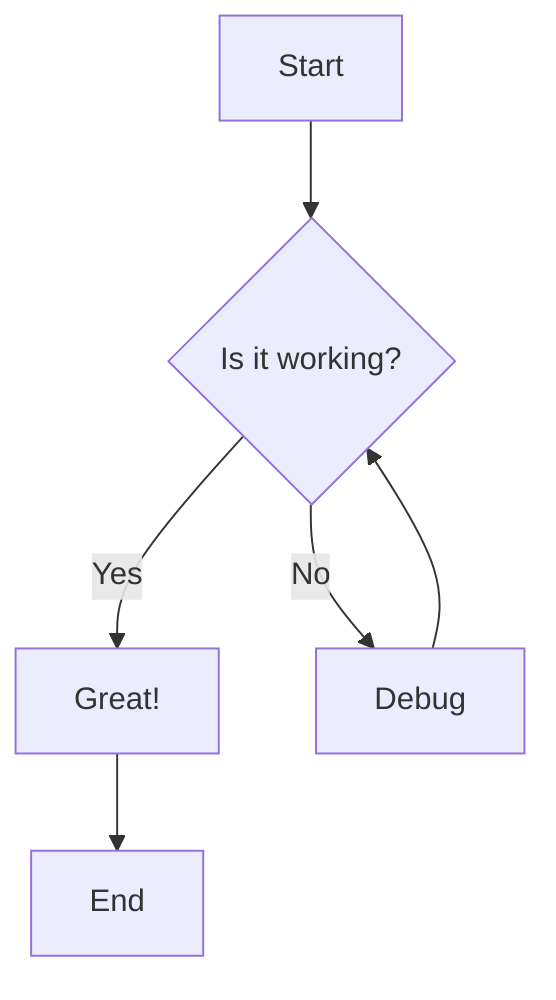
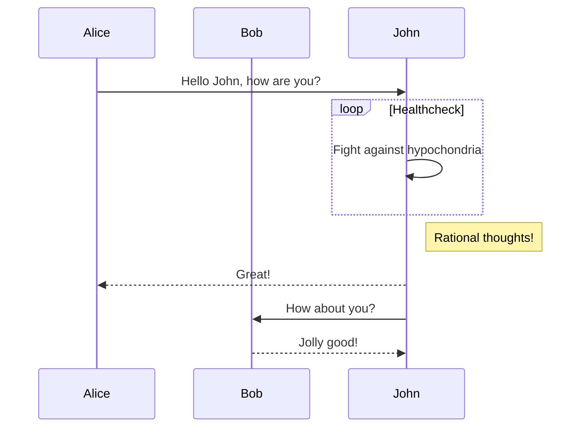
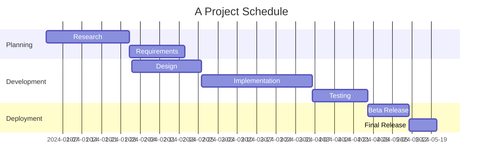
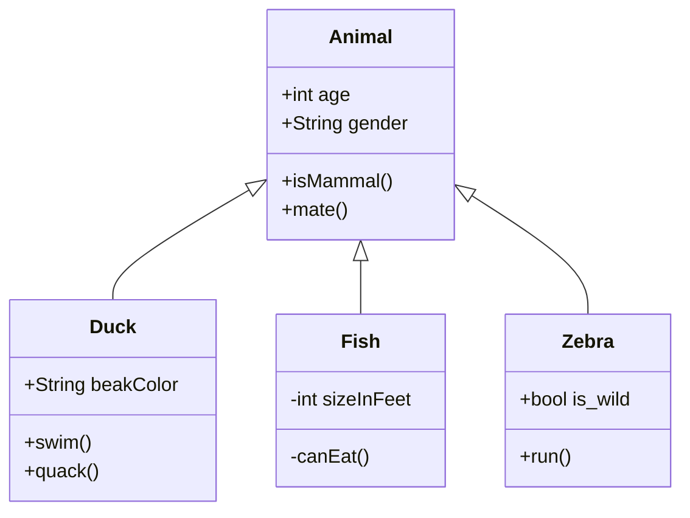
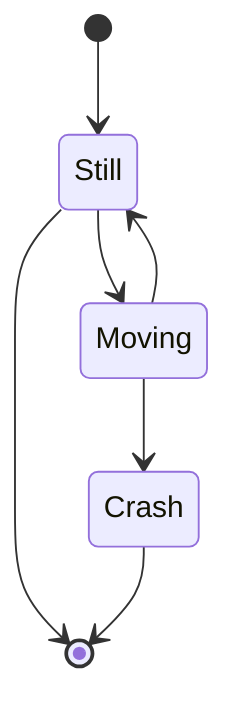
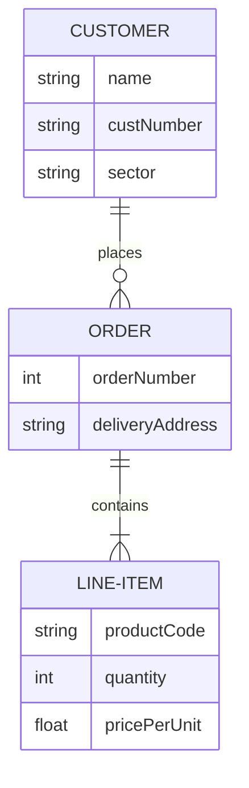
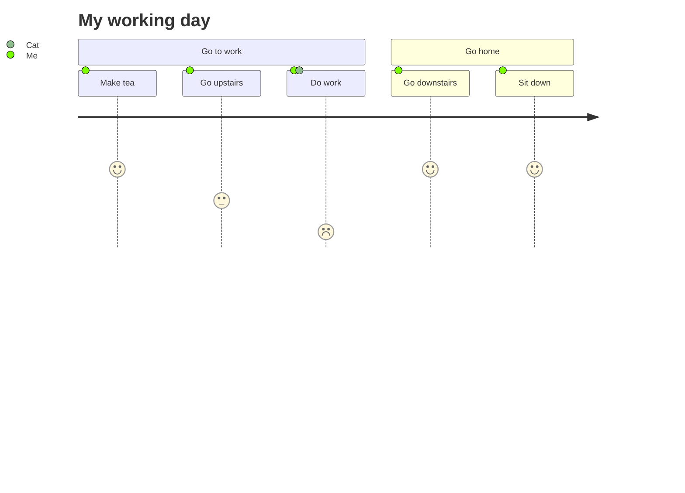
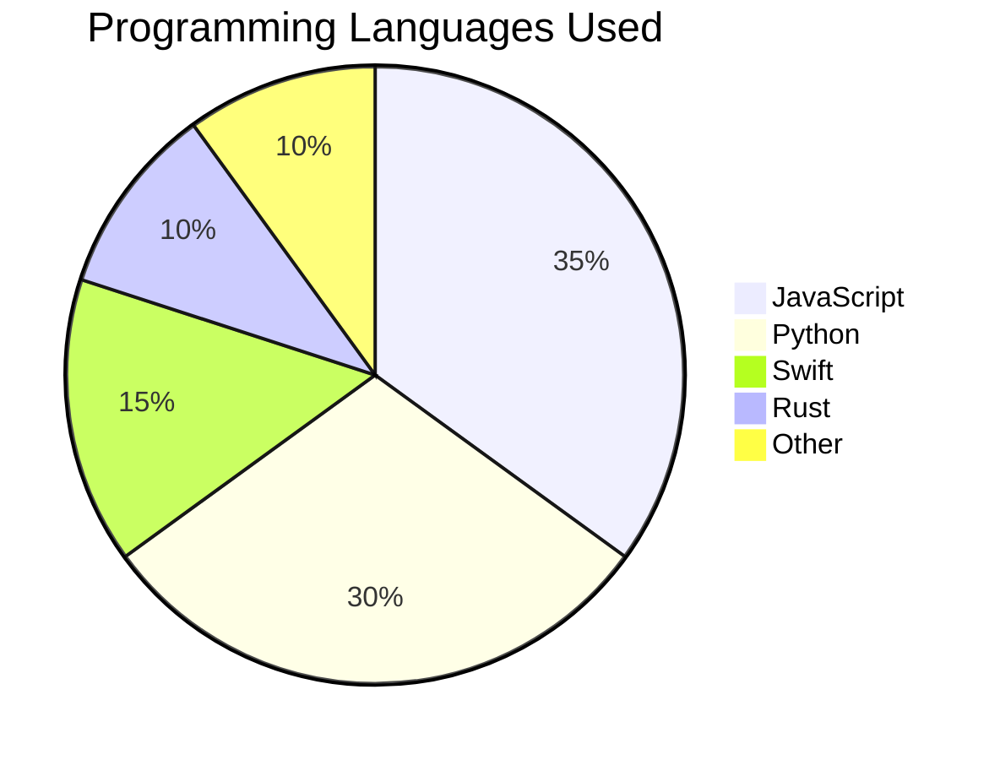
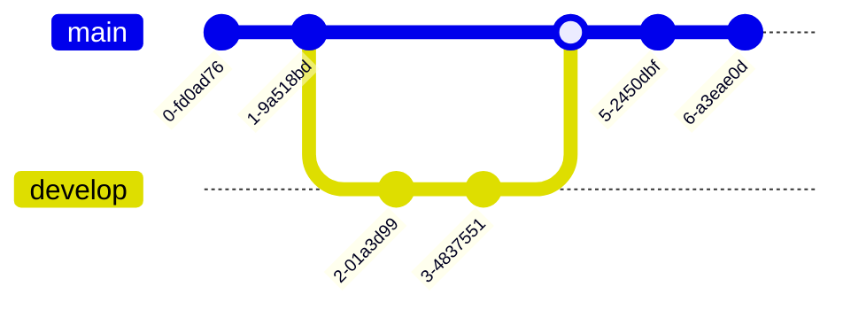
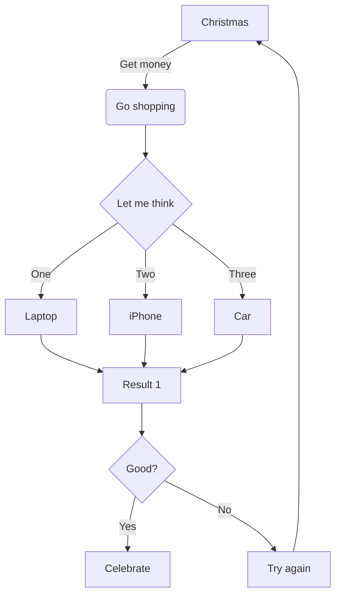

# Mermaid Diagram Test File

This file tests various Mermaid diagram types to verify the QuickLook extension renders them correctly.

## 1. Flowchart

## 2. Sequence Diagram

## 3. Gantt Chart

## 4. Class Diagram

## 5. State Diagram

## 6. Entity Relationship Diagram

## 7. User Journey

## 8. Pie Chart

## 9. Git Graph

## 10. Complex Flowchart

---

## Test Notes

- All diagrams should render as SVG graphics
- Diagrams should adapt to light/dark mode
- Text should be readable and properly sized
- No JavaScript errors in console
- Rendering should be relatively fast

### Expected Behavior

When viewing this file with QuickLook (press Spacebar in Finder):
1. All code blocks marked with `mermaid` should be rendered as diagrams
2. Regular code blocks without `mermaid` should remain as syntax-highlighted code
3. Diagrams should be interactive (zoom, pan if supported)
4. Theme should match system appearance (light/dark)
