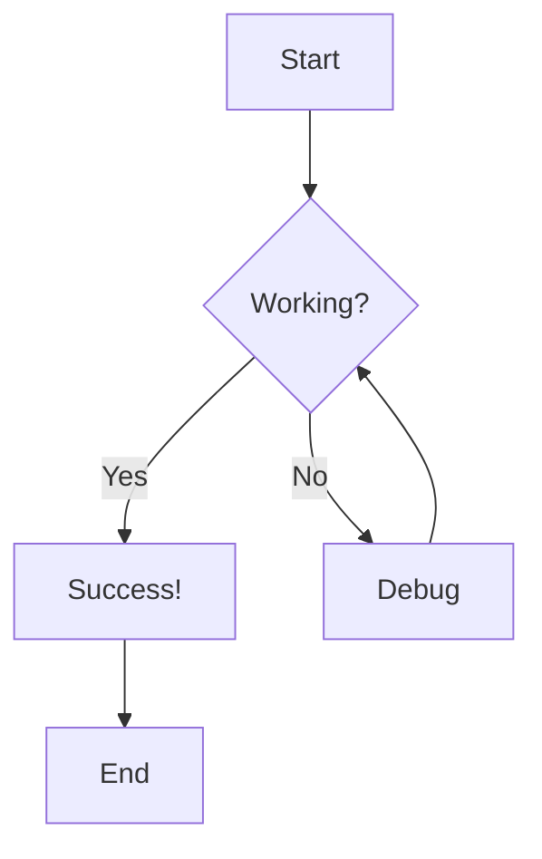
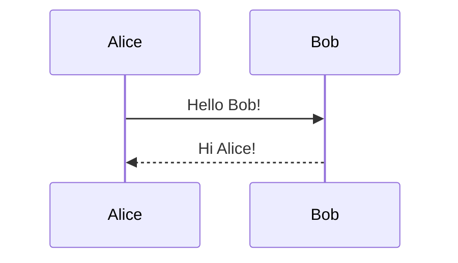

# Simple Mermaid Test

This is a simple test file to verify Mermaid diagrams are working.

## Test Diagram



## Regular Code Block (Should NOT be rendered as diagram)

```javascript
console.log("This should remain as code");
function test() {
    return true;
}
```

## Another Mermaid Diagram


